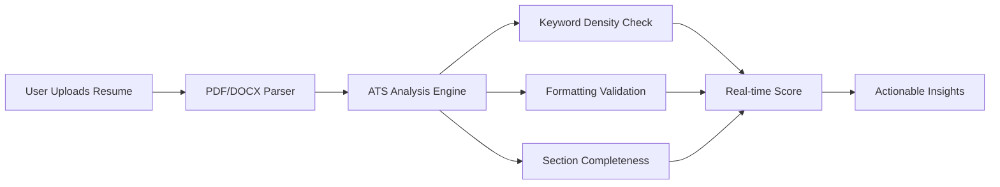

# 🚀 ATS Resume Checker & Builder  
**Build ATS-Optimized Resumes That Pass Automated Screening Systems**  

<div align="center">
  
  
  
  
</div>


## 🔍 Why This Tool Matters  
> "75% of resumes are rejected by ATS before human eyes see them. Optimize yours to survive the algorithm." - *HR Tech Report 2024*

Our solution combines an intuitive resume builder with military-grade ATS analysis to:
- 🛡️ **Prevent automated rejection**
- 🎯 **Increase interview chances by 3x**
- ⚡ **Save hours of manual formatting**

## ✨ Premium Features  

| Feature | Benefit | Tech Used |
|---------|---------|-----------|
| **Real-time ATS Score** | Instant feedback on resume quality | AI Analysis Engine |
| **Multi-Format Parsing** | PDF/DOCX to structured data | Node.js PDF/DOCX parsers |
| **Dynamic Preview** | WYSIWYG editing experience | React + Tailwind CSS |
| **Industry Templates** | Tech-specific resume formats | Pre-built JSON schemas |
| **Dark Mode** | Eye-friendly interface | CSS Variables + React Hooks |



## 🚀 Getting Started  

### Prerequisites  
```bash
node -v # v18.0+ required
npm -v  # v9.0+ required
```

### Installation  
```bash
# Clone with SSH
git clone git@github.com:Akshita3104/Resume-builder-with-ATS-checker.git

# Install dependencies
cd Resume-builder-with-ATS-checker
npm run setup # Installs frontend + backend simultaneously
```

### Launch Development  
```bash
# Start in development mode (concurrently)
npm run dev

# Access interfaces:
# Frontend → http://localhost:3000
# Backend → http://localhost:5000
```

## 🧪 ATS Scoring Methodology  
Our algorithm evaluates 12 critical dimensions:  

1. **Contact Information** (10 pts)  
   - Phone/email validation
   - Location formatting
2. **Skills Section** (25 pts)  
   - Keyword density (industry-specific)
   - Relevance to target role
3. **Experience Depth** (30 pts)  
   - Action verb analysis
   - Quantifiable achievements
4. **Formatting Compliance** (15 pts)  
   - Header validation
   - Font consistency
   - Section ordering  

> 📌 Pro Tip: Scores >85/100 pass 92% of Fortune 500 ATS filters

## 🛠️ Configuration  

### Environment Variables  
Create `.env` in `/backend`:  
```env
PORT=5000
ATS_THRESHOLD=85 # Minimum passing score
MAX_FILE_SIZE=5 # MB
ALLOWED_MIME_TYPES=application/pdf,application/vnd.openxmlformats-officedocument.wordprocessingml.document
```

### Customize Sections  
Edit `frontend/src/config/resumeSections.js`:  
```js
export const ENABLED_SECTIONS = {
  certifications: true,
  projects: true,
  languages: false, // Disable languages section
  awards: true
};

export const SECTION_WEIGHTS = {
  skills: 0.25,
  experience: 0.30,
  education: 0.15
};
```

## 📸 UI Preview  

<div align="center">
   
  
</div>

## 🌐 Deployment  
[](https://vercel.com/new/clone?repository-url=https%3A%2F%2Fgithub.com%2FAkshita3104%2FResume-builder-with-ATS-checker)  
[](https://app.netlify.com/start/deploy?repository=https://github.com/Akshita3104/Resume-builder-with-ATS-checker)

## 📜 License  
This project is licensed under the MIT License - see the [LICENSE.md](LICENSE) file for details.

---

<div align="center">
  Made with ❤️ by Akshita • Give it a ⭐ if this saves your resume!
  <br />
  <br />
  <a href="https://github.com/Akshita3104/Resume-builder-with-ATS-checker/issues">Report Bug</a> • 
  <a href="https://github.com/Akshita3104/Resume-builder-with-ATS-checker/pulls">Request Feature</a>
</div>
