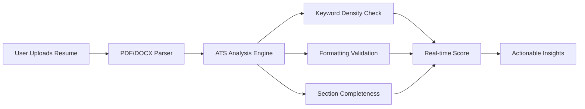

# 🚀 Resume Builder with ATS Checker

**Build ATS-Optimized Resumes That Pass Automated Screening Systems**

<div align="center">
  
  
  
  
</div>

## 🔍 Why This Tool Matters

> "75% of resumes are rejected by ATS before human eyes see them. Optimize yours to survive the algorithm." - _HR Tech Report 2024_

This solution combines an intuitive resume builder with military-grade ATS analysis to:

- 🛡️ **Prevent automated rejection**
- 🎯 **Increase interview chances by 3x**
- ⚡ **Save hours of manual formatting**

## ✨ Premium Features

| Feature                  | Benefit                            | Tech Used                   |
| ------------------------ | ---------------------------------- | --------------------------- |
| **Real-time ATS Score**  | Instant feedback on resume quality | AI Analysis Engine          |
| **Multi-Format Parsing** | PDF/DOCX to structured data        | Node.js PDF/DOCX parsers    |
| **Dynamic Preview**      | WYSIWYG editing experience         | React + Tailwind CSS        |
| **Industry Templates**   | Tech-specific resume formats       | Pre-built JSON schemas      |
| **Dark Mode**            | Eye-friendly interface             | CSS Variables + React Hooks |



## 🚀 Getting Started

### Prerequisites

```bash
node -v #
npm -v  #
```

### Installation

```bash
# Clone with SSH
git clone git@github.com:Akshita3104/Resume-builder-with-ATS-checker.git
```

## 🛠️ Configuration

```bash
## Install Backend Dependencies:
cd backend
npm install

## Install Frontend Dependencies:
cd ../frontend
npm install

## Setup Environment Variables:
Create a .env file inside the backend folder with the following content:
GROQ_API_KEY=your_groq_api_key_here
Replace your_groq_api_key_here with your actual API key.
```

### Launch Development

```bash
# Start in development mode (concurrently)
npm run dev
npm start

# Access interfaces:
# Frontend → http://localhost:8080
# Backend → http://localhost:5000
```

## 🧪 ATS Scoring Methodology

Algorithm evaluates critical dimensions like:

1. **Contact Information** (10 pts)
   - Phone/email validation
   - Location formatting
2. **Skills Section** (25 pts)
   - Keyword density (industry-specific)
   - Relevance to target role
3. **Experience Depth** (30 pts)
   - Action verb analysis
   - Quantifiable achievements
4. **Formatting Compliance** (15 pts)
   - Header validation
   - Font consistency
   - Section ordering

## 📸 UI Preview

<div align="center">
   
   
   
  
</div>

## 🌐 Deployment

[](https://resumora-tau.vercel.app/)

## 📜 License

This project is licensed under the MIT License - see the [LICENSE.md](LICENSE) file for details.

---

<div align="center">
  Made with ❤️ by Akshita • Give it a ⭐ if this saves your resume!
  <br />
  <br />
  <a href="https://github.com/Akshita3104/Resume-builder-with-ATS-checker/issues">Report Bug</a> • 
  <a href="https://github.com/Akshita3104/Resume-builder-with-ATS-checker/pulls">Request Feature</a>
</div>
